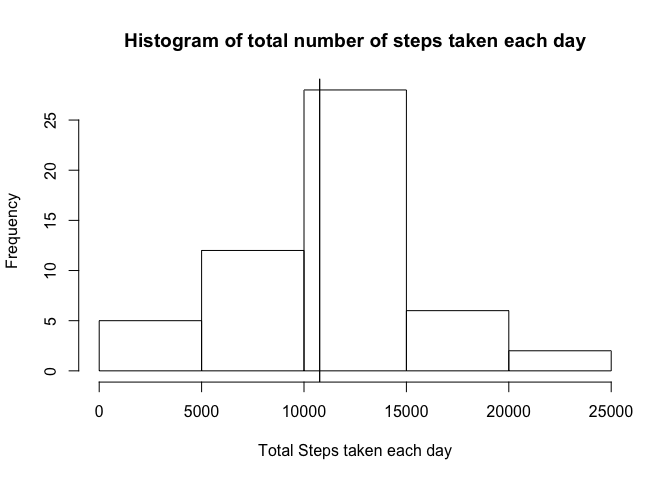
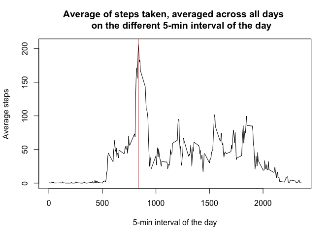
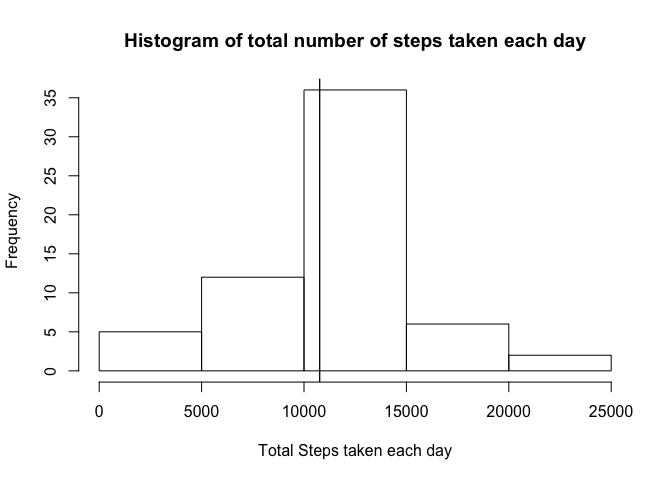
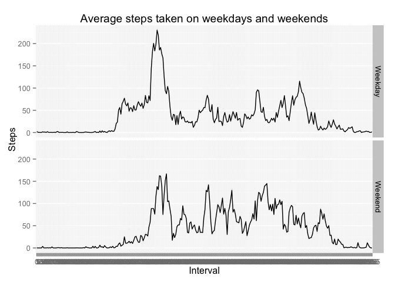

# Reproducible Research: Peer Assessment 1


In this report, we analyse the data from a personal activity monitoring device. The data is collected for two months every 5 minute interval throughout the day. Firstly, we load and have a look at the data.


```r
data <- read.csv("activity.csv",header=TRUE)
head(data,3)
```

```
##   steps       date interval
## 1    NA 2012-10-01        0
## 2    NA 2012-10-01        5
## 3    NA 2012-10-01       10
```

For our anlaysis, we transform the data by making all the 5-minute intervals into a different column. Now in new transformed data set, all the rows are the days on which measurements were taken and all but one column represent 5-minute intervals. The first column of our new transformed data represents the dates on which measurements were taken.


```r
library(reshape2)
new_Data <- dcast(data,date~interval,value.var="steps")
dim(new_Data)
```

```
## [1]  61 289
```

###Mean total number of steps taken per day ignoring NAs
In the data, there are numerous days, where the data is missing. In this and the next part, we ignore the missing values. Firstly, we filter the data without NAs from original data and see that there are 53 days when all the data is available.


```r
no_na_data <- new_Data[complete.cases(new_Data),]
dim(no_na_data)
```

```
## [1]  53 289
```

Next, we need to compute the total number of steps taken per day. Because of our transformation, it can be computed by taking row sums of the data (no_na_data). We call this 53-length vector total_steps_days. Then we calculate the mean and median of the vector total_steps_days. We see that mean and median of total number of steps taken per day differ by only 1.19 steps.


```r
library(dplyr)
total_steps_days <- apply(select(no_na_data,-date),1,sum)
mean_steps <- mean(total_steps_days)
cat("Mean of the total steps per day is:  ", mean_steps)
```

```
## Mean of the total steps per day is:   10766.19
```

```r
median_steps<-median(total_steps_days)
cat("Median of the total steps per day is:  ", median_steps)
```

```
## Median of the total steps per day is:   10765
```

```r
hist(total_steps_days,xlab = "Total Steps taken each day", 
     main = "Histogram of total number of steps taken each day")
abline(v=mean_steps)
abline(v=median_steps)
```

 

According to this histogram, on nearly 28 days out of 53 days, the total number of steps taken by subject are between 10,000 and 15,000. Since the difference between mean and median steps is just 1.19 steps, it is not visible in the histogram. Both the lines nearly coincide.


###Average daily activity pattern ignoring NAs
In this part, we compute average of the number of steps taken in all 5-minute intervals over all days. Again, because of our transformation, it can be computed by taking column means of the data no_na_data. We also compute the 5-minute interval that contains the maximum number of steps on average.


```r
mean_5_minute <- apply(select(no_na_data,-date),2,mean)
max_mean_5_minute <- max(mean_5_minute)
max_index<-which(mean_5_minute %in% max_mean_5_minute)
max_col <- colnames(no_na_data)[max_index+1]
cat("5-min interval containing the maximum number of steps on average is: ", max_col)
```

```
## 5-min interval containing the maximum number of steps on average is:  835
```

```r
plot(colnames(select(no_na_data,-date)),mean_5_minute,type="l",
     xlab = "5-min interval of the day",ylab= "Average steps",
     main = "Average of steps taken, averaged across all days 
     on the different 5-min interval of the day")
abline(v=max_col,col="red")
```

 

###Inputing NA's

In this part, we deal with the missing values. Firstly, we extract the rows with missing values. There are 8 rows or 8 days when the data is not available.


```r
na_data <- new_Data[!complete.cases(new_Data),]
dim(na_data)
```

```
## [1]   8 289
```

```r
cat("Number of rows of missing values: ",dim(na_data)[1])
```

```
## Number of rows of missing values:  8
```

Next, we fill in all the missing values in the na_data with the mean for 5-min interval. In the previous part, we computed the mean_5_minute vector. We use this vector to replace all 8 rows of missing data in na_data so that no value is missing. To obtain a new dataset that is equal to the original dataset but with the missing data filled in, we combine both no_na_data and na_data and arrange the rows in ascending order of date.


```r
for(i in 1:8){
  na_data[i,2:289] <- mean_5_minute
}
merged_data <- rbind(no_na_data,na_data)
merged_data <- arrange(merged_data,date)
dim(merged_data)
```

```
## [1]  61 289
```

In order to make a histogram of total number of steps, we compute a vector of total number of steps taken each day by taking the row sums of our new dataset namely, merged_data and call it sum_steps. Then, we compute its mean and median.


```r
sum_steps <- apply(select(merged_data,-date),1,sum)
mean_steps_per_day <- mean(sum_steps)
cat("Mean of the total steps per day is:  ", mean_steps_per_day)
```

```
## Mean of the total steps per day is:   10766.19
```

```r
median_steps_per_day <- median(sum_steps)
cat("Median of the total steps per day is:  ", median_steps_per_day)
```

```
## Median of the total steps per day is:   10766.19
```

```r
hist(sum_steps,xlab = "Total Steps taken each day", 
     main = "Histogram of total number of steps taken each day")
abline(v=mean_steps_per_day)
abline(v=median_steps_per_day)
```

 

Mean and median of total number of steps taken per day do not differ significantly from the estimates from the first part. Initially, NA values did not contribute anything to the mean/median. We fill these NA's with the average values, that is why we do not see any increase in the frequency of total number of steps in bins other than the bin 10,000-15,000 which contains the average.

###Activity patterns between weekdays and weekends

In this part, we divide all 61 days in two groups namely, Weekday and Weekend. Firstly, we change date column into days of the week and then divide them into weekday or weekend. We calculate the 5-minute average number of steps taken over all weekdays and weekends and call it average_group.


```r
mutated_data<-mutate(merged_data,date= weekdays(as.Date(merged_data$date)))
temp_logical <- (mutated_data$date=="Saturday")|(mutated_data$date=="Sunday") 
week <- rep("Weekday",61)
week[temp_logical] = "Weekend"
mutated_data <- cbind(week,mutated_data)
mutated_data <- select(mutated_data,-(date))
names(mutated_data) <- c("week",colnames(select(no_na_data,-date)))
group_week <- group_by(mutated_data,week)
average_group <- summarise_each(group_week,funs(mean))
```

Since average_group data has only two rows with 289 columns, we transform it from wide to tall using melt function.


```r
melt_avg_gp <- melt(average_group, id = "week")
names(melt_avg_gp) <- c("week","Interval","Steps")
head(melt_avg_gp)
```

```
##      week Interval      Steps
## 1 Weekday        0 2.25115304
## 2 Weekend        0 0.21462264
## 3 Weekday        5 0.44528302
## 4 Weekend        5 0.04245283
## 5 Weekday       10 0.17316562
## 6 Weekend       10 0.01650943
```


```r
library(ggplot2)
g<-ggplot(melt_avg_gp,aes(x=Interval,y=Steps,group=1))+geom_line()
g<-g+facet_grid(week~.)+labs(title="Average steps taken on weekdays and weekends")
g
```

 

The plot shows that the 5-minute interval average of the number of steps is higher on weekends than on weekdays. Moreover, this can be seen computationally.


```r
mean_weekday_weekend<-apply(select(average_group,-week),1,mean)
cat("Mean of the average number of steps on Weekday is:", mean_weekday_weekend[1])
```

```
## Mean of the average number of steps on Weekday is: 35.61058
```

```r
cat("Mean of the average number of steps on Weekend is:", mean_weekday_weekend[2])
```

```
## Mean of the average number of steps on Weekend is: 42.3664
```
